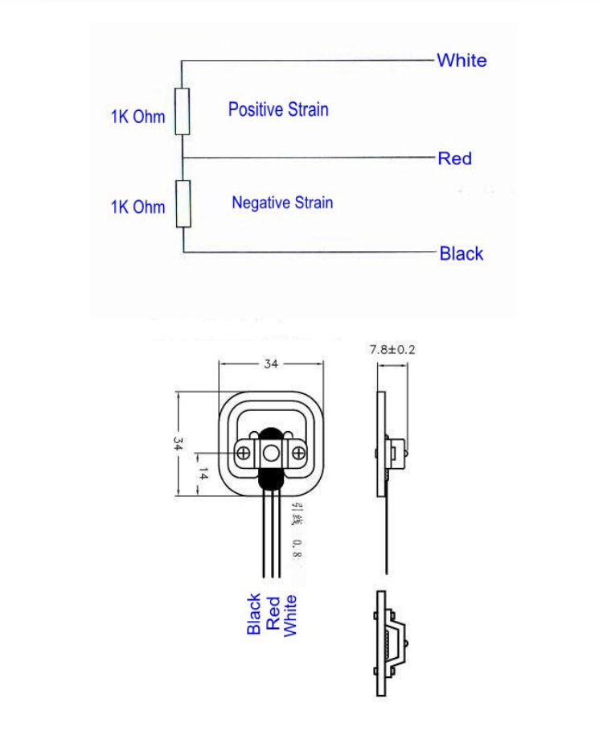

# Smart Scale
### Languages and Tools

 

  

## Materials:
   * Arduino
   * Half bridge load cell 50Kg
   * HX711
   * Resistors 1k +/- 1%
   * Bluetooth 4.0

## Libraries:

## Load Cell Half Bridge 50KG

It is a resistive transducer capable of converting the applied force into an electrical signal, a work performed by the Wheatstone bridge added to other resistors that verify the deformation of the metal to which it is corrected.
There are several models available on market, each with its specifications and purposes, for this project a 50 kg load cell model was used.

## Wiring 4 load cells

## Meta

Ronaldo Almeida – [Linkedin](https://www.linkedin.com/in/ronaldo-almeida-9a8a8316b/) – ronaldoalm1812@edu.unifor.br

[https://github.com/ronaldoalm](https://github.com/ronaldoalm)
